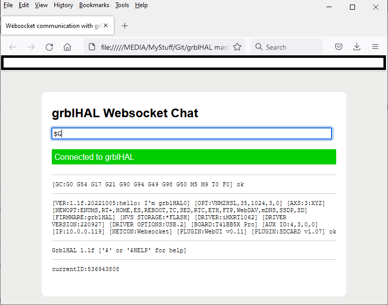

## Networking services plugin

This plugin contains code for network protocol support on top of the lwIP TCP/IP stack.

#### Server protocols supported:

* Telnet \("raw" mode\).
* Websocket.
* FTP \(requires [SD card plugin](https://github.com/grblHAL/Plugin_SD_card) and card inserted\).
* HTTP \(requires [SD card plugin](https://github.com/grblHAL/Plugin_SD_card) and card inserted\).
* WebDAV - as an extension the HTTP daemon. __Note:__ saving files does not yet work with Windows mounts. Tested ok with WinSCP.
* mDNS - \(multicast DomainName Server\).
* SSDP - \(Simple Service Discovery Protocol\). Requires the HTTP daemon running.

The mDNS and SSDP protocols uses UPD multicast/unicast transmission of data and not all drivers are set up to handle that "out-of-the-box".  
Various amount of manual code changes are needed to make them work, see the [RP2040 readme](https://github.com/grblHAL/RP2040/blob/master/README.md).

#### Client protocols supported:

* MQTT - \(MQ Telemetry Transport\). A programming API is provided for plugin code, not used by standard code.

MQTT requires lwIP 2.1.x for authentication support \(username & password\). [Template/example](https://github.com/grblHAL/Templates/tree/master/my_plugin/MQTT_example) code is available.

__NOTE:__ The API is work in progress and calls and call signatures may change.

#### Driver support:

| Driver                                                            |lwIP version| FlashFS              | MQTT API |
|-------------------------------------------------------------------|------------|----------------------|----------|
| [iMXRT1062 \(Teensy 4.1\)](https://github.com/grblHAL/iMXRT1062)  | 2.1.3      | littlefs             | yes      |
| [RP2040 \(Pi Pico W\)](https://github.com/grblHAL/RP2040)         | 2.1.1      | littlefs             | yes      |
| [ESP32](https://github.com/grblHAL/ESP32)                         | ?          | littlefs             | yes      |
| [STM32F4xx](https://github.com/grblHAL/STM32F4xx)                 | 2.1.2      | no                   | yes      |
| [STM32F756](https://github.com/grblHAL/STM32F7xx)                 | 2.1.2      | no                   | yes      |
| [STM32H7xx](https://github.com/dresco/STM32H7xx)                  | ?          | TBA                  | TBA      |
| [MSP432E401Y](https://github.com/grblHAL/MSP432E401Y)             | 2.0.2      | littlefs1 | no       |

#### Dependencies:

[lwIP library](http://savannah.nongnu.org/projects/lwip/) - 2.1.0 or later for http daemon.

Driver capable of networking and having the required "middleware" layer on top of lwIP.

These drivers has this "middleware" layer, further details for how to configure networking can be found on the driver page:

* [iMXRT1062](https://github.com/grblHAL/IMXRT1062) for Teensy 4.1, cabled Ethernet.

* [STM32F4xx](https://github.com/grblHAL/STM32F7xx), cabled Ethernet via SPI \(WizNet module\).

* [STM32F7xx](https://github.com/grblHAL/STM32F7xx) for Nucleo-F756ZG, cabled Ethernet.

* [STM32H7xx](https://github.com/dresco/STM32H7xx), cabled Ethernet.

* [RP2040](https://github.com/grblHAL/RP2040), wireless for Pi Pico W \(wifi\) or cabled Ethernet via SPI \(WizNet module\).

* [MSP432E401Y](https://github.com/grblHAL/MSP432E401Y) for MSP432E401Y LaunchPad, cabled Ethernet.

* [TM4C129](https://github.com/grblHAL/TM4C129) for EK-TM4C1294XL Launchpad, cabled Ethernet.

* [ESP32](https://github.com/grblHAL/ESP32), wireless \(wifi\).

#### Credits:

Parts of _websocket.c_ are pulled from [patch 9525](http://savannah.nongnu.org/patch/?9525) by Sakari Kapanen.

_base64.c_, _sha1.c_ by Brad Conte, pulled from from the same patch as mentioned above.

[multipartparser.c](https://github.com/francoiscolas/multipart-parser) by Fran&ccedil;ois Colas. 

[ftpd code](https://github.com/toelke/lwip-ftpd) by Florian Schulze, Philipp T&ouml;lke and David Olofson \(modified by Terje Io for grblHAL use\).

[httpd code](http://savannah.nongnu.org/projects/lwip/) by Adam Dunkels and Simon Goldschmidt \(modified by Terje Io for grblHAL use\).

[cJSON](https://github.com/DaveGamble/cJSON) Dave Gamble and cJSON contributors.

_wschat.html_ modified from original by [tutorialspoint.com](https://www.tutorialspoint.com/websockets/websockets_javascript_application.htm), for simple websocket testing \(edit line 103 to set address and port before use\).

__NOTE:__ some drivers uses ports of lwIP provided by the MCU supplier.  
__NOTE:__ this plugin is only for the protocol layer. Driver specific code is required for initialising lwIP and start/stop/polling the services.

---
#### Simple websocket test app:

---
2023-12-26
